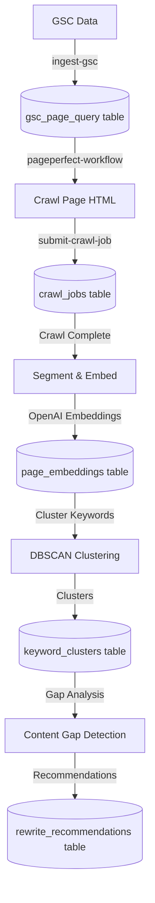

# PagePerfect System Documentation

## Overview

PagePerfect is an AI-powered SEO optimization system that analyzes your content against Google Search Console (GSC) data to identify content gaps and optimization opportunities. It uses vector embeddings, semantic clustering, and intelligent analysis to help you rank higher for relevant keywords.

**Key Capabilities**:
- 📊 GSC data ingestion with advanced filtering
- 🧮 Vector embeddings for content and keywords
- 🎯 DBSCAN semantic clustering
- 🔍 Content gap detection
- 📈 Opportunity scoring algorithm
- 🔄 Orchestrated workflow system
- ⏱️ Scheduled batch processing via cron

## Architecture Overview

### High-Level Flow



### System Components

1. **GSC Ingestion** (`ingest-gsc`)
   - Fetches data from Google Search Console API
   - Filters by position, impressions, clicks
   - Stores page-keyword pairs with metrics
   - Handles pagination and rate limiting

2. **Page Crawling** (`submit-crawl-job`, `fetch-crawl-data`)
   - Uses ScraperAPI for reliable HTML fetching
   - Stores full HTML content
   - Tracks crawl status and timestamps
   - Supports premium/ultra-premium proxies

3. **Content Segmentation** (`segment-and-embed-page`)
   - Parses HTML with Cheerio
   - Extracts paragraphs and headings
   - Generates OpenAI embeddings (text-embedding-ada-002)
   - Stores paragraph-level embeddings

4. **Keyword Clustering** (`keyword-clustering`)
   - Generates embeddings for keywords
   - Applies DBSCAN algorithm for semantic grouping
   - Calculates cluster statistics
   - Identifies cluster representatives

5. **Content Gap Analysis** (`content-gap-analysis`)
   - Compares keyword clusters to page content
   - Calculates cosine similarity
   - Identifies missing topics (gaps)
   - Scores opportunities by impressions and position

6. **Workflow Orchestration** (`pageperfect-workflow`)
   - Chains all steps in sequence
   - Checks dependencies
   - Tracks execution status
   - Implements smart caching

7. **Batch Processing** (`pageperfect-batch-processor`, cron functions)
   - Scheduled GSC data ingestion
   - Automatic CTR recalibration
   - URL queue processing
   - Batch operations

## Detailed Workflow

### Step 1: GSC Data Ingestion

**Function**: `ingest-gsc/index.ts`

**Purpose**: Fetch keyword and performance data from Google Search Console.

```typescript
// Request format
{
  "siteUrl": "https://example.com" | "sc-domain:example.com",
  "startDate": "2025-01-01",
  "endDate": "2025-01-31",
  "rowLimit": 50000,
  "startRow": 0,
  "gscCredentials": {
    "private_key": "...",
    "client_email": "service-account@project.iam.gserviceaccount.com"
  },
  "filters": {
    "minPosition": 5,
    "maxPosition": 50,
    "minImpressions": 10,
    "maxKeywordsPerUrl": 100,
    "keywordsSortBy": "impressions",  // "impressions", "clicks", "position"
    "specificUrls": ["https://example.com/page1", "https://example.com/page2"]
  }
}

// Response format
{
  "success": true,
  "message": "GSC data ingested successfully",
  "rowsProcessed": 1234,
  "date": "2025-01-01",
  "rowsFetched": 1500,
  "siteUrl": "https://example.com",
  "service_account": "service-account@project.iam.gserviceaccount.com"
}
```

**Key Features**:
- **Authentication**: Service account JWT, OAuth token, or direct API token
- **Pagination**: Automatic handling of 25K row API limit
- **Retry Logic**: Exponential backoff for rate limits (429) and 5xx errors
- **Token Caching**: In-memory cache for service account tokens (55min TTL)
- **Filtering**: Position, impressions, clicks, specific URLs
- **Site Verification**: Checks available GSC properties and access levels

**Key Code**:
```typescript
// JWT token generation with caching
async function getGoogleToken(credentials: any): Promise<string> {
  // Check cache first
  if (credentials.client_email) {
    const cacheKey = credentials.client_email
    const cachedToken = tokenCache[cacheKey]
    const now = Math.floor(Date.now() / 1000)

    if (cachedToken && cachedToken.expires > now + 300) {
      return cachedToken.token
    }
  }

  // Generate new JWT
  const token = await getGoogleAccessToken(credentials)

  // Cache for 55 minutes
  tokenCache[cacheKey] = {
    token,
    expires: Math.floor(Date.now() / 1000) + 3300
  }

  return token
}

// Fetch with retry logic
async function fetchWithRetry(url: string, options: RequestInit, maxRetries = 3): Promise<Response> {
  let retries = 0

  while (retries <= maxRetries) {
    const response = await fetch(url, options)

    // Retry on 429 or 5xx with exponential backoff
    if (response.status === 429 || (response.status >= 500 && response.status < 600)) {
      const delay = Math.min(1000 * Math.pow(2, retries) + Math.random() * 1000, 10000)
      await new Promise(resolve => setTimeout(resolve, delay))
      retries++
      continue
    }

    return response
  }
}

// Data transformation with filtering
function transformGSCData(gscData: any, fetchDate: string, filters: GSCFilterCriteria = {}): any[] {
  let processedRows = gscData.rows.map((row: any) => ({
    fetched_date: fetchDate,
    page_url: row.keys[0],
    keyword: row.keys[1],
    clicks: row.clicks || 0,
    impressions: row.impressions || 0,
    ctr: row.ctr || 0,
    position: row.position || 0
  }))

  // Apply filters
  processedRows = processedRows.filter((item: any) => {
    if (filters.minPosition !== undefined && item.position < filters.minPosition) return false
    if (filters.maxPosition !== undefined && item.position > filters.maxPosition) return false
    if (filters.minImpressions !== undefined && item.impressions < filters.minImpressions) return false
    if (filters.minClicks !== undefined && item.clicks < filters.minClicks) return false
    return true
  })

  // Apply maxKeywordsPerUrl filter
  if (filters.maxKeywordsPerUrl) {
    const urlGroups: Record<string, any[]> = {}
    processedRows.forEach((row: any) => {
      if (!urlGroups[row.page_url]) urlGroups[row.page_url] = []
      urlGroups[row.page_url].push(row)
    })

    let limitedRows: any[] = []
    Object.keys(urlGroups).forEach(url => {
      const sorted = urlGroups[url].sort((a, b) =>
        filters.keywordsSortBy === 'position' ? a.position - b.position : b.impressions - a.impressions
      )
      limitedRows = limitedRows.concat(sorted.slice(0, filters.maxKeywordsPerUrl))
    })

    return limitedRows
  }

  return processedRows
}
```

**Flow Chart**:
```
┌──────────────────────┐
│  Validate Request    │
│  - siteUrl           │
│  - dateRange         │
│  - credentials       │
└──────────┬───────────┘
           │
           ▼
┌──────────────────────┐
│  Get/Generate Token  │
│  - Check cache       │
│  - Generate JWT      │
│  - Cache for 55min   │
└──────────┬───────────┘
           │
           ▼
┌──────────────────────┐
│  Test GSC Access     │
│  - Fetch sites list  │
│  - Verify permission │
│  - Match site format │
└──────────┬───────────┘
           │
           ▼
┌──────────────────────┐
│  Paginated Fetch     │
│  - 25K rows per page │
│  - Retry with backoff│
│  - Collect all pages │
└──────────┬───────────┘
           │
           ▼
┌──────────────────────┐
│  Transform & Filter  │
│  - Apply position    │
│  - Apply impressions │
│  - Limit per URL     │
└──────────┬───────────┘
           │
           ▼
┌──────────────────────┐
│  Bulk Insert to DB   │
│  - bulk_insert_gsc   │
│  - page_query table  │
└──────────────────────┘
```

### Step 2: Page Crawling

**Function**: `submit-crawl-job/index.ts`

**Purpose**: Fetch and store HTML content for analysis.

**Key Features**:
- ScraperAPI integration
- Premium/ultra-premium proxy support
- JavaScript rendering option
- Configurable timeout
- Status tracking

**Key Code**:
```typescript
// Submit crawl job
const response = await fetch(`https://api.scraperapi.com/?api_key=${apiKey}&url=${encodeURIComponent(url)}&premium=${premium}&render=${render}`)

const html = await response.text()

// Store in database
await supabase
  .from('pages')
  .upsert({
    url,
    html,
    last_crawled: new Date().toISOString(),
    crawl_status: 'completed'
  })
```

### Step 3: Content Segmentation & Embedding

**Function**: `segment-and-embed-page/index.ts`

**Purpose**: Break content into paragraphs and generate vector embeddings.

**Key Features**:
- Cheerio-based HTML parsing
- Removes scripts, styles, navigation
- Extracts main content area
- Preserves heading hierarchy
- Parallel embedding generation

**Key Code**:
```typescript
// Segment HTML into paragraphs
function segmentPageContent(html: string): Paragraph[] {
  const $ = load(html)
  const paragraphs: Paragraph[] = []
  let paraIndex = 0

  // Remove noise
  $('script, style, nav, footer, header, .sidebar, .menu, .navigation, .comments, .ads').remove()

  // Extract main content
  const mainContent = $('main, #main, .main, article, .article, .content, #content, .post, #post')
  const contentElement = mainContent.length > 0 ? mainContent : $('body')

  // Find paragraph-like elements
  contentElement.find('p, h1, h2, h3, h4, h5, h6, li, blockquote, pre, td').each((_, element) => {
    const text = $(element).text().trim()

    if (text.length > 0) {
      let content = text
      const tagName = element.tagName.toLowerCase()

      // Mark headings
      if (tagName.match(/^h[1-6]$/)) {
        content = `[${tagName.toUpperCase()}] ${text}`
      }

      paragraphs.push({
        paraIndex: paraIndex++,
        content
      })
    }
  })

  return paragraphs
}

// Generate embeddings in parallel
const embedResults = await Promise.all(
  paragraphs.map(async (para) => {
    const embedding = await generateEmbedding(para.content, apiKey)
    return {
      pageId,
      paraIndex: para.paraIndex,
      content: para.content,
      embedding
    }
  })
)

// OpenAI embedding API call
async function generateEmbedding(text: string, apiKey: string): Promise<number[]> {
  const response = await fetch('https://api.openai.com/v1/embeddings', {
    method: 'POST',
    headers: {
      'Authorization': `Bearer ${apiKey}`,
      'Content-Type': 'application/json',
    },
    body: JSON.stringify({
      model: 'text-embedding-ada-002',
      input: text,
    }),
  })

  const result = await response.json()
  return result.data[0].embedding  // 1536-dimensional vector
}
```

**Flow Chart**:
```
┌──────────────────────┐
│  Fetch Page HTML     │
│  from pages table    │
└──────────┬───────────┘
           │
           ▼
┌──────────────────────┐
│  Parse with Cheerio  │
│  - Remove noise      │
│  - Find main content │
└──────────┬───────────┘
           │
           ▼
┌──────────────────────┐
│  Extract Paragraphs  │
│  - <p> tags          │
│  - Headings (H1-H6)  │
│  - List items (<li>) │
│  - Blockquotes       │
└──────────┬───────────┘
           │
           ▼
┌──────────────────────┐
│  Generate Embeddings │
│  - OpenAI API        │
│  - Parallel requests │
│  - 1536-dim vectors  │
└──────────┬───────────┘
           │
           ▼
┌──────────────────────┐
│  Store Embeddings    │
│  - Delete existing   │
│  - Bulk insert new   │
│  - page_embeddings   │
└──────────────────────┘
```

### Step 4: Keyword Clustering

**Function**: `keyword-clustering/index.ts`

**Purpose**: Group semantically similar keywords using DBSCAN algorithm.

**Key Features**:
- OpenAI embeddings for keywords
- DBSCAN clustering algorithm
- Configurable epsilon and minSamples
- Cluster statistics calculation
- Representative keyword selection

**DBSCAN Algorithm**:
```
Density-Based Spatial Clustering of Applications with Noise

Parameters:
- epsilon (ε): Maximum distance between two points to be neighbors (default: 0.15)
- minSamples: Minimum points to form a dense region (default: 3)

Steps:
1. Mark all points as unvisited
2. For each unvisited point P:
   a. Mark P as visited
   b. Find neighbors (points within epsilon distance)
   c. If neighbors < minSamples, mark as noise
   d. Else, start new cluster:
      - Add P to cluster
      - For each neighbor N:
        - If unvisited, mark visited and find its neighbors
        - If N not in any cluster, add to current cluster
```

**Key Code**:
```typescript
// DBSCAN implementation
function dbscan(
  keywords: Keyword[],
  epsilon: number,
  minSamples: number
): Record<number, Keyword[]> {
  const visited: Record<string, boolean> = {}
  const clusters: Record<number, Keyword[]> = {}
  let clusterId = 0

  for (const point of keywords) {
    if (visited[point.id]) continue

    visited[point.id] = true
    const neighbors = regionQuery(keywords, point, epsilon)

    // Noise point
    if (neighbors.length < minSamples) {
      point.clusterId = -1
      continue
    }

    // Core point - start new cluster
    const currentClusterId = clusterId++
    point.clusterId = currentClusterId
    clusters[currentClusterId] = [point]

    // Expand cluster
    let neighborIndex = 0
    while (neighborIndex < neighbors.length) {
      const neighbor = neighbors[neighborIndex++]

      if (!visited[neighbor.id]) {
        visited[neighbor.id] = true
        const newNeighbors = regionQuery(keywords, neighbor, epsilon)

        if (newNeighbors.length >= minSamples) {
          neighbors.push(...newNeighbors.filter(n =>
            !neighbors.some(existing => existing.id === n.id)
          ))
        }
      }

      if (neighbor.clusterId === undefined || neighbor.clusterId === -1) {
        neighbor.clusterId = currentClusterId
        clusters[currentClusterId].push(neighbor)
      }
    }
  }

  return clusters
}

// Find neighbors within epsilon distance
function regionQuery(keywords: Keyword[], point: Keyword, epsilon: number): Keyword[] {
  if (!point.embedding) return []

  return keywords.filter(other => {
    if (!other.embedding) return false
    return point.id !== other.id &&
           euclideanDistance(point.embedding, other.embedding) <= epsilon
  })
}

// Euclidean distance between vectors
function euclideanDistance(a: number[], b: number[]): number {
  return Math.sqrt(
    a.reduce((sum, val, i) => sum + Math.pow(val - b[i], 2), 0)
  )
}
```

**Cluster Statistics**:
```typescript
const clusterResults = Object.entries(clusters).map(([clusterId, members]) => {
  const avgImpressions = members.reduce((sum, k) => sum + k.impressions, 0) / members.length
  const avgPosition = members.reduce((sum, k) => sum + k.position, 0) / members.length
  const sortedMembers = [...members].sort((a, b) => b.impressions - a.impressions)

  return {
    clusterId: parseInt(clusterId),
    size: members.length,
    representative: sortedMembers[0].keyword,  // Highest impressions
    topKeywords: sortedMembers.slice(0, 5).map(k => k.keyword),
    keywords: members.map(k => k.keyword),
    avgImpressions,
    avgPosition,
    totalImpressions: members.reduce((sum, k) => sum + k.impressions, 0)
  }
})
```

### Step 5: Content Gap Analysis

**Function**: `content-gap-analysis/index.ts` (inferred from workflow)

**Purpose**: Identify keyword clusters not well-covered by existing content.

**Algorithm**:
```
For each keyword cluster:
  1. Get cluster centroid (average of keyword embeddings)
  2. For each paragraph embedding:
     - Calculate cosine similarity with cluster centroid
  3. Find max similarity score
  4. If max similarity < threshold (e.g., 0.65):
     - Mark as content gap
     - Calculate opportunity score
  5. Sort gaps by opportunity score
```

**Opportunity Scoring**:
```typescript
OpportunityScore = 0.7 * PositionScore + 0.3 * ImpressionScore

PositionScore = 1 / (1 + e^(0.5 * (position - 10)))
ImpressionScore = log10(impressions + 1) / 10
```

This formula:
- Prioritizes positions 5-15 (biggest potential gain)
- Values high-impression keywords
- Balances both factors (70/30 split)

### Step 6: Workflow Orchestration

**Function**: `pageperfect-workflow/index.ts`

**Purpose**: Chain all PagePerfect steps in the correct order with dependency management.

**Workflow Steps**:
```typescript
const workflowSteps: WorkflowStep[] = [
  {
    name: 'crawl',
    function: 'submit-crawl-job',
    depends: [],
    params: () => ({ url, pageId, premium, ultraPremium, render })
  },
  {
    name: 'waitForCrawl',
    function: 'wait-for-crawl-job',
    depends: ['crawl'],
    params: (data) => ({ jobId: data.crawl.jobId, maxWaitTimeMs: 300000 })
  },
  {
    name: 'embed',
    function: 'segment-and-embed-page',
    depends: ['waitForCrawl'],
    params: () => ({ pageId, openaiApiKey })
  },
  {
    name: 'cluster',
    function: 'keyword-clustering',
    depends: ['embed'],
    params: () => ({ pageId, openaiApiKey })
  },
  {
    name: 'analyze',
    function: 'content-gap-analysis',
    depends: ['embed', 'cluster'],
    params: () => ({ pageId, openaiApiKey })
  },
  {
    name: 'rewrite',
    function: 'generate-rewrite-draft',
    depends: ['analyze'],
    params: (data) => {
      const topGap = data.analyze?.gapAnalysis?.[0]
      return { pageId, clusterId: topGap?.clusterId, openaiApiKey }
    }
  }
]
```

**Key Features**:
- **Dependency Checking**: Won't execute step if dependencies not met
- **Smart Caching**: Skips recently executed steps (24-hour window)
- **Status Tracking**: Records start/complete/error events
- **Timeout Handling**: Different timeouts per step type
- **Force Update**: Override caching with `forceUpdate: true`
- **Step Skipping**: Selectively skip steps with `skipSteps: ['crawl', 'embed']`

**Key Code**:
```typescript
// Check if step needs execution
let shouldExecute = forceUpdate

if (!shouldExecute) {
  const { data: recentExecution } = await supabase
    .from('pageperfect_processing_events')
    .select('created_at')
    .eq('page_id', pageId)
    .eq('event_type', `${step.name}_complete`)
    .gt('created_at', new Date(Date.now() - 24 * 60 * 60 * 1000).toISOString())
    .limit(1)

  shouldExecute = !recentExecution || recentExecution.length === 0
}

if (!shouldExecute) {
  console.log(`Skipping step (recently executed): ${step.name}`)

  // Get cached results
  const { data: prevResult } = await supabase
    .from('pageperfect_processing_events')
    .select('details')
    .eq('page_id', pageId)
    .eq('event_type', `${step.name}_complete`)
    .order('created_at', { ascending: false })
    .limit(1)

  if (prevResult && prevResult.length > 0) {
    results[step.name] = prevResult[0].details.result
  }

  continue
}
```

## Database Schema

### gsc_page_query

Primary GSC data storage:

```sql
CREATE TABLE gsc_page_query (
  id UUID PRIMARY KEY DEFAULT uuid_generate_v4(),
  fetched_date DATE NOT NULL,
  page_url TEXT NOT NULL,
  keyword TEXT NOT NULL,
  clicks INTEGER DEFAULT 0,
  impressions INTEGER DEFAULT 0,
  ctr REAL DEFAULT 0,
  position REAL DEFAULT 0,
  created_at TIMESTAMPTZ DEFAULT NOW(),
  UNIQUE(fetched_date, page_url, keyword)
);

CREATE INDEX idx_gsc_page_query_page ON gsc_page_query(page_url);
CREATE INDEX idx_gsc_page_query_keyword ON gsc_page_query(keyword);
CREATE INDEX idx_gsc_page_query_position ON gsc_page_query(position);
CREATE INDEX idx_gsc_page_query_impressions ON gsc_page_query(impressions);
```

### pages

Page metadata and HTML storage:

```sql
CREATE TABLE pages (
  id UUID PRIMARY KEY DEFAULT uuid_generate_v4(),
  url TEXT UNIQUE NOT NULL,
  html TEXT,
  last_crawled TIMESTAMPTZ,
  crawl_status TEXT,  -- 'pending', 'completed', 'failed'
  created_at TIMESTAMPTZ DEFAULT NOW(),
  updated_at TIMESTAMPTZ DEFAULT NOW()
);
```

### page_embeddings

Paragraph-level vector embeddings:

```sql
CREATE TABLE page_embeddings (
  id UUID PRIMARY KEY DEFAULT uuid_generate_v4(),
  page_id UUID REFERENCES pages(id) ON DELETE CASCADE,
  para_index INTEGER NOT NULL,
  content TEXT NOT NULL,
  embedding vector(1536),  -- pgvector extension
  created_at TIMESTAMPTZ DEFAULT NOW(),
  UNIQUE(page_id, para_index)
);

CREATE INDEX idx_page_embeddings_page ON page_embeddings(page_id);
CREATE INDEX idx_page_embeddings_vector ON page_embeddings USING ivfflat (embedding vector_cosine_ops);
```

### gsc_keywords (inferred)

Keyword data with embeddings:

```sql
CREATE TABLE gsc_keywords (
  id UUID PRIMARY KEY DEFAULT uuid_generate_v4(),
  page_id UUID REFERENCES pages(id),
  keyword TEXT NOT NULL,
  impressions INTEGER DEFAULT 0,
  position REAL DEFAULT 0,
  clicks INTEGER DEFAULT 0,
  ctr REAL DEFAULT 0,
  embedding vector(1536),
  cluster_id INTEGER,
  created_at TIMESTAMPTZ DEFAULT NOW()
);

CREATE INDEX idx_gsc_keywords_page ON gsc_keywords(page_id);
CREATE INDEX idx_gsc_keywords_cluster ON gsc_keywords(cluster_id);
```

### keyword_clusters (inferred)

Cluster metadata:

```sql
CREATE TABLE keyword_clusters (
  id INTEGER PRIMARY KEY,
  page_id UUID REFERENCES pages(id),
  representative_keyword TEXT,
  size INTEGER,
  avg_impressions REAL,
  avg_position REAL,
  total_impressions INTEGER,
  centroid vector(1536),
  created_at TIMESTAMPTZ DEFAULT NOW()
);
```

### pageperfect_processing_events

Workflow execution tracking:

```sql
CREATE TABLE pageperfect_processing_events (
  id UUID PRIMARY KEY DEFAULT uuid_generate_v4(),
  page_id UUID REFERENCES pages(id),
  event_type TEXT NOT NULL,  -- 'workflow_start', 'crawl_complete', 'embed_complete', etc.
  details JSONB,
  created_at TIMESTAMPTZ DEFAULT NOW()
);

CREATE INDEX idx_pageperfect_events_page ON pageperfect_processing_events(page_id);
CREATE INDEX idx_pageperfect_events_type ON pageperfect_processing_events(event_type);
```

## Configuration

### Environment Variables

```bash
# OpenAI API for embeddings
OPENAI_API_KEY=sk-...

# GSC service account credentials (JSON)
GSC_CREDENTIALS={"private_key":"...","client_email":"..."}

# Or direct API token
GSC_API_TOKEN=ya29....

# ScraperAPI for web crawling
SCRAPER_API_KEY=...

# Supabase (auto-set)
SUPABASE_URL=https://project.supabase.co
SUPABASE_SERVICE_ROLE_KEY=eyJ...
```

### Clustering Parameters

Tuning DBSCAN for your use case:

| Parameter | Default | Description | When to Increase | When to Decrease |
|-----------|---------|-------------|------------------|------------------|
| `epsilon` | 0.15 | Max distance for neighbors | Keywords too tightly clustered | Too many noise points |
| `minSamples` | 3 | Min points for cluster | Small, fragmented clusters | Want tighter clusters |
| `minImpressions` | 10 | Filter low-traffic keywords | Too much noise | Missing long-tail keywords |

## Performance Considerations

### Embedding Generation

- **Cost**: ~$0.0001 per 1K tokens (text-embedding-ada-002)
- **Rate Limit**: 3,000 RPM (requests per minute)
- **Optimization**: Batch embed multiple items, cache results

### Vector Search

- **pgvector IVFFlat Index**: Approximates nearest neighbors
- **Index Parameters**: `lists` parameter affects speed vs accuracy
- **Query**: Use `vector_cosine_ops` for cosine similarity

### Workflow Caching

- **24-Hour Cache**: Prevents re-running expensive steps
- **Force Update**: Override cache when content significantly changes
- **Event Table**: Lightweight logging, low overhead

## Monitoring & Debugging

### Check PagePerfect Status

```sql
-- Get recent workflow events
SELECT page_id, event_type, created_at, details
FROM pageperfect_processing_events
WHERE page_id = 'page-id-here'
ORDER BY created_at DESC;

-- Check page embeddings
SELECT COUNT(*), AVG(LENGTH(content))
FROM page_embeddings
WHERE page_id = 'page-id-here';

-- View keyword clusters
SELECT cluster_id, COUNT(*) as size, AVG(impressions), AVG(position)
FROM gsc_keywords
WHERE page_id = 'page-id-here' AND cluster_id IS NOT NULL
GROUP BY cluster_id
ORDER BY AVG(impressions) DESC;

-- Find content gaps (low similarity scores)
SELECT
  k.cluster_id,
  k.representative_keyword,
  MAX(pe.embedding <=> kc.centroid) as max_similarity
FROM keyword_clusters k
JOIN page_embeddings pe ON pe.page_id = k.page_id
WHERE k.page_id = 'page-id-here'
GROUP BY k.cluster_id, k.representative_keyword
HAVING MAX(pe.embedding <=> kc.centroid) < 0.65
ORDER BY k.total_impressions DESC;
```

### GSC Data Quality

```sql
-- Check date range coverage
SELECT MIN(fetched_date), MAX(fetched_date), COUNT(DISTINCT fetched_date)
FROM gsc_page_query;

-- Top pages by impressions
SELECT page_url, SUM(impressions) as total_impressions, COUNT(DISTINCT keyword) as keyword_count
FROM gsc_page_query
WHERE fetched_date >= NOW() - INTERVAL '30 days'
GROUP BY page_url
ORDER BY total_impressions DESC
LIMIT 20;

-- Position distribution
SELECT
  CASE
    WHEN position <= 3 THEN '1-3'
    WHEN position <= 10 THEN '4-10'
    WHEN position <= 20 THEN '11-20'
    ELSE '21+'
  END as position_bucket,
  COUNT(*) as keyword_count,
  SUM(impressions) as total_impressions
FROM gsc_page_query
WHERE fetched_date >= NOW() - INTERVAL '30 days'
GROUP BY position_bucket
ORDER BY position_bucket;
```

## Integration Example

### Running Full PagePerfect Workflow

```typescript
async function analyzePageForSEO(url: string) {
  // Step 1: Ensure GSC data is ingested (run separately/scheduled)
  // This would typically be done via cron, not per-page

  // Step 2: Run PagePerfect workflow
  const response = await fetch('https://project.supabase.co/functions/v1/pageperfect-workflow', {
    method: 'POST',
    headers: {
      'Content-Type': 'application/json',
      'Authorization': `Bearer ${SUPABASE_SERVICE_KEY}`,
    },
    body: JSON.stringify({
      url,
      forceUpdate: false,  // Use cache if available
      skipSteps: [],
      openaiApiKey: process.env.OPENAI_API_KEY,
      premium: false,
      render: true,
    }),
  })

  const result = await response.json()

  if (result.success) {
    console.log('Page analysis complete')
    console.log('Workflow results:', result.results)

    // Access specific results
    const embeddings = result.results.embed
    const clusters = result.results.cluster
    const gaps = result.results.analyze

    // Display content gaps
    console.log('Content gaps found:', gaps.gapAnalysis?.length)
    gaps.gapAnalysis?.forEach(gap => {
      console.log(`- ${gap.representative}: ${gap.opportunityScore.toFixed(2)} opportunity score`)
    })
  } else {
    console.error('Workflow failed:', result.error)
  }
}
```

## Related Documentation

- [GSC Integration System](./GSC-INTEGRATION-SYSTEM.md)
- [PlanPerfect System](./PLANPERFECT-SYSTEM.md)
- [Outline Generation System](./OUTLINE-GENERATION-SYSTEM.md)
- [Fast Mode Outline Guide](../outline-fast-readme.md)
