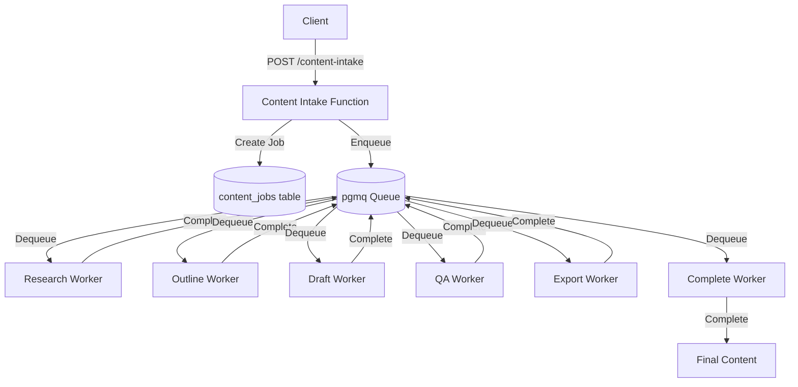

# PlanPerfect System Documentation

## Overview

PlanPerfect is an AI-powered content generation system that orchestrates a multi-stage pipeline to create high-quality, SEO-optimized content. The system uses a worker-based architecture with queue management to handle long-running content generation tasks without hitting Edge Function timeout limits.

**Key Capabilities**:
- 🔄 Multi-stage content pipeline (Research → Outline → Draft → QA → Export → Complete)
- ⏱️ Asynchronous job processing with queue management
- 🔁 Automatic retry logic with exponential backoff
- 📊 Granular status tracking and event logging
- 🎯 Stage-specific worker specialization
- ⚡ Fire-and-forget execution pattern
- 🚀 High-scale throughput with batch dequeueing
- 🔧 Priority-based queue processing
- ⚰️ Dead letter queue for manual intervention
- 📈 Queue depth introspection and monitoring

## Architecture Overview

### High-Level Flow



### System Components

1. **Intake Function** (`content-intake`)
   - Entry point for content generation requests
   - Creates job records in database
   - Enqueues jobs into pgmq queue
   - Returns job_id immediately (fire-and-forget)

2. **Worker Functions** (6 specialized workers)
   - `content-research-worker`: Research and information gathering
   - `content-outline-worker`: Structure and outline creation
   - `content-draft-worker`: Full content generation
   - `content-qa-worker`: Quality assurance and validation
   - `content-export-worker`: Format and export preparation
   - `content-complete-worker`: Finalization and cleanup

3. **Queue System** (pgmq)
   - PostgreSQL-based message queue (pgmq extension)
   - Message visibility timeout (default: 600 seconds)
   - Automatic message archiving after processing
   - Stage-based routing

4. **Database Tables**
   - `content_jobs`: Job metadata and current status
   - `content_payloads`: Stage-specific data and results
   - `content_events`: Granular event logging
   - `content_stages`: Stage execution tracking

## Detailed Workflow

### Stage 1: Content Intake

**Function**: `content-intake/index.ts`

**Purpose**: Accept content generation requests and initialize the job pipeline.

```typescript
// Request format
{
  "job_type": "article" | "schema",
  "requester_email": "user@example.com",
  "payload": {
    "title": "Article Title",
    "keywords": ["keyword1", "keyword2"],
    "domain": "example.com"
  },
  "initial_stage": "research"  // Optional, defaults to "research"
}

// Response format
{
  "job_id": "uuid-here",
  "status": "queued",
  "stage": "research"
}
```

**Key Code**:
```typescript
// Create job in database
const { data, error } = await supabaseAdmin
  .from('content_jobs')
  .insert({
    job_type: jobType,
    requester_email: body.requester_email,
    payload,
    status: 'queued',
    stage: initialStage,
  })
  .select('id')
  .single()

// Log event
await insertEvent(jobId, 'queued', 'Job queued by intake', {
  payload_keys: Object.keys(payload)
})

// Enqueue to appropriate queue
await enqueueJob(
  jobType === 'schema' ? 'schema' : 'content',
  jobId,
  initialStage,
  payload
)
```

**Flow Chart**:
```
┌─────────────────┐
│  Client Request │
└────────┬────────┘
         │
         ▼
┌─────────────────┐
│ Validate Request│
│  - job_type     │
│  - payload      │
└────────┬────────┘
         │
         ▼
┌─────────────────┐
│  Create Job     │
│  Record in DB   │
└────────┬────────┘
         │
         ▼
┌─────────────────┐
│  Insert Event   │
│  "queued"       │
└────────┬────────┘
         │
         ▼
┌─────────────────┐
│  Enqueue to     │
│  pgmq Queue     │
└────────┬────────┘
         │
         ▼
┌─────────────────┐
│  Return job_id  │
│  to Client      │
└─────────────────┘
```

### Stage 2: Research Worker

**Function**: `content-research-worker/index.ts`

**Purpose**: Gather research data, search APIs, scrape sources, and prepare research foundation.

**Key Features**:
- Dequeues messages from pgmq
- Checks stage and forwards if mismatched
- Tracks attempt count for retries
- Runs work in background (fire-and-forget)
- Archives message after processing

**Key Code**:
```typescript
// Dequeue message with visibility timeout
const { data, error } = await supabaseAdmin.rpc('dequeue_stage', {
  p_queue: 'content',
  p_visibility: visibility, // 600 seconds default
})

// Stage validation and forwarding
if (stage !== 'research') {
  console.log(`Research worker received stage ${stage}, forwarding`)
  await enqueueJob('content', jobId, stage, payload)
  await supabaseAdmin.rpc('archive_message', {
    p_queue: 'content',
    p_msg_id: msg_id
  })
  return
}

// Start stage tracking
await insertEvent(jobId, 'processing', 'Research stage started', payload)
const attempt = await startStage(jobId, 'research')

// Background work (fire-and-forget)
const work = (async () => {
  // TODO: Implement real research
  const researchResult = {
    note: 'Research worker placeholder',
    payload,
    completed_at: new Date().toISOString(),
  }

  // Save results
  await supabaseAdmin
    .from('content_payloads')
    .upsert({ job_id: jobId, stage: 'research', data: researchResult })

  // Complete stage
  await completeStage(jobId, 'research')

  // Update job to next stage
  await supabaseAdmin
    .from('content_jobs')
    .update({ stage: 'outline', status: 'queued' })
    .eq('id', jobId)

  // Enqueue next stage
  await enqueueJob('content', jobId, 'outline', { from: 'research-worker' })

  // Archive message
  await supabaseAdmin.rpc('archive_message', {
    p_queue: 'content',
    p_msg_id: msg_id
  })
})()

runBackground(work) // Fire and forget
```

**Flow Chart**:
```
┌──────────────────┐
│ Dequeue Message  │
│  from pgmq       │
└────────┬─────────┘
         │
         ▼
    ┌─────────┐
    │ Empty?  │───Yes──▶ Return 204 No Content
    └────┬────┘
         │ No
         ▼
┌──────────────────┐
│  Extract job_id  │
│  stage, payload  │
└────────┬─────────┘
         │
         ▼
    ┌─────────────┐
    │Stage Match? │───No──▶ Forward to Correct Stage
    └────┬────────┘
         │ Yes
         ▼
┌──────────────────┐
│  Insert Event    │
│  "processing"    │
└────────┬─────────┘
         │
         ▼
┌──────────────────┐
│  Start Stage     │
│  (attempt count) │
└────────┬─────────┘
         │
         ▼
┌──────────────────┐
│  Fire-and-Forget │
│  Background Work │
└────────┬─────────┘
         │
         ▼
┌──────────────────┐
│  Return 202      │
│  "scheduled"     │
└──────────────────┘

Background Process:
         │
         ▼
┌──────────────────┐
│  Do Research     │
│  (API calls,     │
│   scraping, etc) │
└────────┬─────────┘
         │
         ▼
┌──────────────────┐
│  Save Results    │
│  to Payloads     │
└────────┬─────────┘
         │
         ▼
┌──────────────────┐
│  Complete Stage  │
└────────┬─────────┘
         │
         ▼
┌──────────────────┐
│  Update Job      │
│  stage="outline" │
└────────┬─────────┘
         │
         ▼
┌──────────────────┐
│  Enqueue Next    │
│  Stage           │
└────────┬─────────┘
         │
         ▼
┌──────────────────┐
│  Archive Message │
└──────────────────┘
```

### Stage 3: Outline Worker

**Function**: `content-outline-worker/index.ts`

**Purpose**: Generate structured outline based on research data.

**Key Features**:
- Same pattern as research worker
- Dequeue → Validate → Process → Enqueue next
- Stores outline structure in payloads
- Forwards to draft stage upon completion

**Key Code**:
```typescript
const work = (async () => {
  const outlineResult = {
    note: 'Outline worker placeholder',
    sections: [],
    completed_at: new Date().toISOString(),
  }

  await supabaseAdmin
    .from('content_payloads')
    .upsert({ job_id: jobId, stage: 'outline', data: outlineResult })

  await completeStage(jobId, 'outline')

  await supabaseAdmin
    .from('content_jobs')
    .update({ stage: 'draft', status: 'queued' })
    .eq('id', jobId)

  await enqueueJob('content', jobId, 'draft', { from: 'outline-worker' })

  await supabaseAdmin.rpc('archive_message', {
    p_queue: 'content',
    p_msg_id: msg_id
  })
})()
```

### Stage 4: Draft Worker

**Function**: `content-draft-worker/index.ts`

**Purpose**: Generate full content draft based on outline and research.

**Key Features**:
- Retrieves research and outline data from previous stages
- Generates complete article content
- Forwards to QA stage for validation

### Stage 5: QA Worker

**Function**: `content-qa-worker/index.ts`

**Purpose**: Quality assurance and validation of generated content.

**Key Features**:
- Validates content quality
- Checks for completeness
- Verifies SEO requirements
- Forwards to export stage

### Stage 6: Export Worker

**Function**: `content-export-worker/index.ts`

**Purpose**: Format content for final export (WordPress, Shopify, etc).

**Key Features**:
- Formats content for target platform
- Generates schema markup
- Prepares images and media
- Forwards to complete stage

### Stage 7: Complete Worker

**Function**: `content-complete-worker/index.ts`

**Purpose**: Finalize job and trigger any post-processing.

**Key Features**:
- Marks job as complete
- Triggers notifications
- Archives job data
- Cleanup temporary resources

## Error Handling & Retry Logic

### Retry Mechanism

Each worker implements automatic retry logic:

```typescript
const maxAttempts = Number(Deno.env.get('CONTENT_STAGE_MAX_ATTEMPTS') ?? '3')

try {
  // Do work...
  await completeStage(jobId, 'research')
} catch (workerError) {
  console.error('Research worker failure', workerError)
  await insertEvent(jobId, 'error', 'Research stage failed', { error: workerError })
  await failStage(jobId, 'research', workerError)

  // Retry if under max attempts
  if (attempt < maxAttempts) {
    await enqueueJob('content', jobId, 'research', payload)
  }
  await supabaseAdmin.rpc('archive_message', {
    p_queue: 'content',
    p_msg_id: msg_id
  })
}
```

### Error States

| Status | Description | Action |
|--------|-------------|--------|
| `queued` | Job waiting in queue | Normal state |
| `processing` | Worker actively processing | Normal state |
| `completed` | Stage completed successfully | Move to next stage |
| `error` | Stage failed | Retry if attempts < max |
| `failed` | All retries exhausted | Manual intervention required |

## Database Schema

### content_jobs

Primary job tracking table with retry metadata:

```sql
CREATE TABLE content_jobs (
  id UUID PRIMARY KEY DEFAULT gen_random_uuid(),
  job_type TEXT NOT NULL,
  requester_email TEXT,
  payload JSONB NOT NULL DEFAULT '{}'::jsonb,
  status TEXT NOT NULL DEFAULT 'queued',
  stage TEXT NOT NULL DEFAULT 'intake',
  priority INTEGER NOT NULL DEFAULT 0,
  max_attempts INTEGER NOT NULL DEFAULT 5,
  attempt_count INTEGER NOT NULL DEFAULT 0,
  retry_delay_seconds INTEGER NOT NULL DEFAULT 60,
  first_queued_at TIMESTAMPTZ,
  last_queued_at TIMESTAMPTZ,
  last_dequeued_at TIMESTAMPTZ,
  last_completed_at TIMESTAMPTZ,
  last_failed_at TIMESTAMPTZ,
  last_dead_letter_at TIMESTAMPTZ,
  created_at TIMESTAMPTZ NOT NULL DEFAULT now(),
  updated_at TIMESTAMPTZ NOT NULL DEFAULT now()
);
```

### content_payloads

Stage-specific results storage:

```sql
CREATE TABLE content_payloads (
  job_id UUID REFERENCES content_jobs(id),
  stage TEXT NOT NULL,
  data JSONB NOT NULL,
  created_at TIMESTAMPTZ DEFAULT NOW(),
  updated_at TIMESTAMPTZ DEFAULT NOW(),
  PRIMARY KEY (job_id, stage)
);
```

### content_events

Granular event logging:

```sql
CREATE TABLE content_events (
  id UUID PRIMARY KEY DEFAULT uuid_generate_v4(),
  job_id UUID REFERENCES content_jobs(id),
  event_type TEXT NOT NULL,  -- 'queued', 'processing', 'completed', 'error'
  message TEXT,
  metadata JSONB,
  created_at TIMESTAMPTZ DEFAULT NOW()
);
```

### content_job_stages

Stage-level execution tracking with retry metadata:

```sql
CREATE TABLE content_job_stages (
  job_id UUID REFERENCES content_jobs(id) ON DELETE CASCADE,
  stage TEXT NOT NULL,
  status TEXT NOT NULL DEFAULT 'pending',
  attempt_count INTEGER NOT NULL DEFAULT 0,
  max_attempts INTEGER NOT NULL DEFAULT 3,
  priority INTEGER NOT NULL DEFAULT 0,
  retry_delay_seconds INTEGER NOT NULL DEFAULT 60,
  visibility_timeout_seconds INTEGER NOT NULL DEFAULT 600,
  available_at TIMESTAMPTZ NOT NULL DEFAULT now(),
  last_queued_at TIMESTAMPTZ,
  last_dequeued_at TIMESTAMPTZ,
  next_retry_at TIMESTAMPTZ,
  dead_lettered_at TIMESTAMPTZ,
  dead_letter_reason TEXT,
  started_at TIMESTAMPTZ,
  finished_at TIMESTAMPTZ,
  last_error JSONB,
  PRIMARY KEY (job_id, stage)
);
```

### content_dead_letters

Dead letter queue for permanently failed jobs:

```sql
CREATE TABLE content_dead_letters (
  id BIGSERIAL PRIMARY KEY,
  queue_name TEXT NOT NULL,
  msg_id BIGINT,
  job_id UUID,
  stage TEXT,
  payload JSONB NOT NULL,
  failure_reason TEXT,
  error_details JSONB,
  attempt_count INTEGER NOT NULL DEFAULT 0,
  routed_at TIMESTAMPTZ NOT NULL DEFAULT now(),
  created_at TIMESTAMPTZ NOT NULL DEFAULT now()
);
```

## Queue Management (pgmq) - Enhanced with Hardening

### Enqueue Function (with priority and delay support)

```typescript
// _shared/queue.ts
await enqueueJob('content', jobId, 'research', payload, {
  priority: 5,
  delaySeconds: 30,
  visibilitySeconds: 600,
  maxAttempts: 6,
  retryDelaySeconds: 120,
})
```

> Passing a number instead of an object is treated as `delaySeconds`. For example `enqueueJob('content', jobId, 'research', payload, 45)` delays the message for 45 seconds before it becomes visible.


### Batch Dequeue Function (NEW)

```typescript
// Dequeue multiple messages at once for high-throughput workers
const messages = await batchDequeueJobs('content', 600, 10)

for (const { msg_id, message } of messages) {
  const { job_id, stage, payload } = message
  // Process job in parallel or sequentially
}
```

### Single Dequeue Function

```typescript
// Used by all workers
const { data, error } = await supabaseAdmin.rpc('dequeue_stage', {
  p_queue: 'content',
  p_visibility_seconds: 600, // Visibility timeout in seconds
})

if (!data || data.length === 0) {
  // No messages in queue
  return new Response(JSON.stringify({ message: 'no messages' }), { status: 204 })
}

const { msg_id, message } = data[0]
const { job_id, stage, payload } = message
```

### Dead Letter Queue Support (NEW)

When a job exceeds max retry attempts, it can be moved to the dead letter queue for manual inspection:

```typescript
import { moveToDeadLetter } from '../_shared/queue.ts'
import { shouldDeadLetter } from '../_shared/stages.ts'

if (await shouldDeadLetter(jobId, stage)) {
  await moveToDeadLetter(
    queue,
    msg_id,
    jobId,
    stage,
    message,
    'Max retry attempts exceeded',
    { error: lastError },
    attemptCount
  )
}
```

### Visibility Extension (NEW)

For long-running jobs, extend visibility timeout to prevent premature re-queueing:

```typescript
import { extendVisibility } from '../_shared/queue.ts'

// Extend visibility by 5 more minutes
await extendVisibility(queue, msg_id, jobId, stage, 300)
```

### Delayed Requeue (NEW)

Requeue a job with exponential backoff delay:

```typescript
import { delayedRequeueJob } from '../_shared/queue.ts'

await delayedRequeueJob(queue, msg_id, jobId, stage, payload, {
  baseDelaySeconds: 60, // Will be multiplied by 2^attempt
  priorityOverride: 5,
  visibilitySeconds: 600,
})
```

### Queue Depth Introspection (NEW)

Monitor queue depth and message age for operational insights:

```typescript
import { getQueueDepth } from '../_shared/queue.ts'

const metrics = await getQueueDepth('content')
// Returns: { queue_name, queue_length, newest_msg_age_sec, oldest_msg_age_sec, total_messages }
```

### Message Visibility Timeout

**Purpose**: Prevents message from being dequeued by another worker while being processed.

- Default: 600 seconds (10 minutes)
- Configurable per-enqueue via `visibilitySeconds` option
- If worker doesn't archive message before timeout, it becomes visible again
- Enables automatic retry on worker crashes
- Can be extended dynamically with `extendVisibility()`

## Configuration

### Environment Variables

```bash
# Queue visibility timeout (seconds)
CONTENT_QUEUE_VISIBILITY=600

# Maximum retry attempts per stage
CONTENT_STAGE_MAX_ATTEMPTS=3

# Supabase connection (auto-set)
SUPABASE_URL=https://project.supabase.co
SUPABASE_SERVICE_ROLE_KEY=eyJ...

# API keys for content generation
ANTHROPIC_API_KEY=sk-ant-...
OPENAI_API_KEY=sk-...
GROQ_API_KEY=gsk_...
```

### Worker Configuration

Each worker can have custom config.toml:

```toml
# supabase/functions/content-research-worker/config.toml
verify_jwt = false  # No JWT verification for background workers
```

## Performance Considerations

### Fire-and-Forget Pattern

Workers return immediately (202 Accepted) and run work in background:

```typescript
// Return response ASAP
const work = (async () => {
  // Long-running work here...
})()

runBackground(work)

return new Response(JSON.stringify({ message: 'scheduled', job_id: jobId }), {
  status: 202,
})
```

**Benefits**:
- Avoids Edge Function 60-second timeout
- Allows parallel processing
- Enables automatic retries
- Provides better error handling

### Stage Isolation

Each stage is independent:
- Can be developed separately
- Can be deployed independently
- Can be scaled independently
- Failures don't affect other stages

### Message Archiving

Messages are archived (not deleted) for audit trail:
- Debugging failed jobs
- Understanding processing patterns
- Monitoring queue health
- Compliance and logging

## Monitoring & Debugging

### Check Job Status

```sql
-- Get job current state
SELECT id, job_type, status, stage, created_at, updated_at
FROM content_jobs
WHERE id = 'job-id-here';

-- Get all events for a job
SELECT event_type, message, metadata, created_at
FROM content_events
WHERE job_id = 'job-id-here'
ORDER BY created_at DESC;

-- Get stage execution details
SELECT stage, status, attempt_count, started_at, completed_at, error_message
FROM content_stages
WHERE job_id = 'job-id-here'
ORDER BY started_at;

-- Get stage payloads
SELECT stage, data
FROM content_payloads
WHERE job_id = 'job-id-here';
```

### Check Queue Health

```sql
-- Check message count in queue
SELECT pgmq.queue_metrics('content');

-- View messages in queue (debugging)
SELECT * FROM pgmq.content_queue
LIMIT 10;

-- View archived messages
SELECT * FROM pgmq.content_archive
ORDER BY archived_at DESC
LIMIT 10;
```

### Common Issues

| Issue | Symptoms | Solution |
|-------|----------|----------|
| Worker timeout | Jobs stuck in processing | Increase visibility timeout |
| All retries exhausted | Jobs in failed state | Check error_message in content_stages |
| Queue backlog | High message count | Scale up worker invocations |
| Stage mismatch | Worker receives wrong stage | Check stage forwarding logic |
| Missing payload | Worker errors on data access | Verify previous stage completed |

## Integration Example

### Creating a Content Generation Job

```typescript
// Client code
async function generateArticle() {
  const response = await fetch('https://project.supabase.co/functions/v1/content-intake', {
    method: 'POST',
    headers: {
      'Content-Type': 'application/json',
      'Authorization': `Bearer ${SUPABASE_ANON_KEY}`,
    },
    body: JSON.stringify({
      job_type: 'article',
      requester_email: 'user@example.com',
      payload: {
        title: 'How to Build a Content Pipeline',
        keywords: ['content', 'pipeline', 'automation'],
        domain: 'example.com',
        word_count: 2000,
      },
    }),
  })

  const { job_id } = await response.json()
  console.log('Job created:', job_id)

  // Poll for completion
  const interval = setInterval(async () => {
    const statusRes = await fetch(`https://project.supabase.co/rest/v1/content_jobs?id=eq.${job_id}`, {
      headers: {
        'Authorization': `Bearer ${SUPABASE_ANON_KEY}`,
        'apikey': SUPABASE_ANON_KEY,
      },
    })

    const [job] = await statusRes.json()

    if (job.status === 'completed') {
      clearInterval(interval)
      console.log('Job completed!', job)
    } else if (job.status === 'failed') {
      clearInterval(interval)
      console.error('Job failed')
    }
  }, 5000) // Poll every 5 seconds
}
```

## Future Enhancements

### Planned Features
- [ ] Real research implementation (search APIs, web scraping)
- [ ] AI-powered outline generation
- [ ] Multiple AI providers (Claude, GPT-4, Llama)
- [ ] WordPress publishing integration
- [ ] Shopify publishing integration
- [ ] Schema markup generation
- [ ] Image generation and optimization
- [ ] SEO optimization suggestions
- [ ] A/B testing support
- [ ] Content versioning

### Performance Optimizations
- [ ] Worker pooling for parallel processing
- [ ] Redis caching for frequently accessed data
- [ ] Batch processing for multiple jobs
- [ ] Priority queue implementation
- [ ] Dead letter queue for failed jobs

## Related Documentation

- [Outline Generation System](./OUTLINE-GENERATION-SYSTEM.md)
- [PagePerfect System](./PAGEPERFECT-SYSTEM.md)
- [GSC Integration](./GSC-INTEGRATION-SYSTEM.md)
- [Deployment Guide](../supabase/functions/MASTER_DEPLOYMENT.md)
