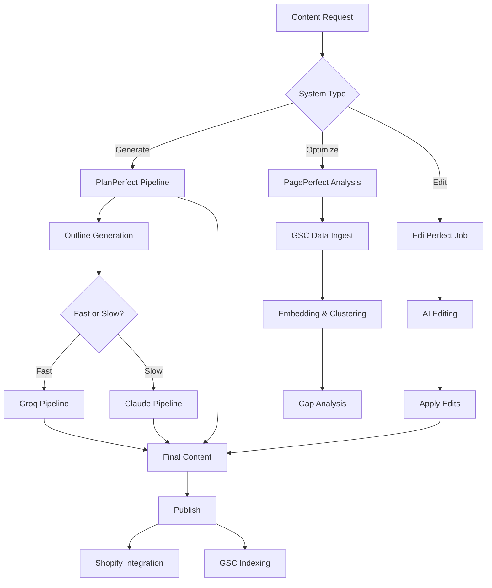

# Systems Overview Documentation

This document provides an overview of all major systems in the pp-supabase platform, with detailed documentation available in separate files for complex systems.

## Table of Contents

1. [PlanPerfect - Content Generation Pipeline](#planperfect-content-generation-pipeline)
2. [PagePerfect - SEO Optimization](#pageperfect-seo-optimization)
3. [Outline Generation System](#outline-generation-system)
4. [GSC Integration System](#gsc-integration-system)
5. [Keyword Classification System](#keyword-classification-system)
6. [Shopify Integration System](#shopify-integration-system)
7. [EditPerfect System](#editperfect-system)

---

## PlanPerfect - Content Generation Pipeline

**📚 Detailed Documentation**: [PLANPERFECT-SYSTEM.md](./PLANPERFECT-SYSTEM.md)

**Purpose**: AI-powered content generation with multi-stage pipeline.

**Key Features**:
- Multi-stage worker pipeline (Research → Outline → Draft → QA → Export → Complete)
- Queue-based asynchronous processing
- Automatic retry logic
- Granular status tracking

**Flow**:
```
Client Request → Intake → Queue → Workers → Final Content
                                  ↓
                            [Research, Outline, Draft, QA, Export, Complete]
```

**Key Functions**:
- `content-intake`: Entry point
- `content-research-worker`: Research stage
- `content-outline-worker`: Outline stage
- `content-draft-worker`: Draft generation
- `content-qa-worker`: Quality assurance
- `content-export-worker`: Export formatting
- `content-complete-worker`: Finalization

---

## PagePerfect - SEO Optimization

**📚 Detailed Documentation**: [PAGEPERFECT-SYSTEM.md](./PAGEPERFECT-SYSTEM.md)

**Purpose**: SEO optimization using GSC data, vector embeddings, and semantic clustering.

**Key Features**:
- GSC data ingestion
- Vector embeddings (OpenAI)
- DBSCAN semantic clustering
- Content gap detection
- Opportunity scoring

**Flow**:
```
GSC Data → Crawl Page → Segment & Embed → Cluster Keywords → Gap Analysis → Recommendations
```

**Key Functions**:
- `ingest-gsc`: Fetch GSC data
- `segment-and-embed-page`: Generate embeddings
- `keyword-clustering`: DBSCAN clustering
- `content-gap-analysis`: Find gaps
- `pageperfect-workflow`: Orchestrate all steps

**Algorithm Highlights**:
```
OpportunityScore = 0.7 * PositionScore + 0.3 * ImpressionScore
PositionScore = 1 / (1 + e^(0.5 * (position - 10)))
ImpressionScore = log10(impressions + 1) / 10
```

---

## Outline Generation System

**Purpose**: Generate structured content outlines with research from search engines.

### Two Modes

#### Slow Mode (Traditional)
**Time**: 10-20 minutes | **Cost**: ~$0.50-$2.00


**Process**:
1. **search-outline-content**: Claude generates search terms
2. **process-search-queue**: Jina.ai batch searches
3. **analyze-outline-content**: Claude Extended Thinking analyzes & generates outline

**Key Features**:
- Battle-tested reliability
- Claude Extended Thinking (23K budget_tokens)
- Jina.ai search for authoritative sources
- 5-6 sections with intro/conclusion
- Detailed URL analysis

#### Fast Mode (New)
**Time**: 2-5 minutes | **Cost**: ~$0.10-$0.30

**📚 Detailed Documentation**: [README-FAST-MODE-OUTLINE.md](../supabase/functions/README-FAST-MODE-OUTLINE.md)


**Process**:
1. **fast-outline-search**: Single Groq API call with browser_search tool
   - Autonomous search strategy
   - Extracts markdown, headings, quotes
   - Brand-aware search

2. **fast-analyze-outline-content**: Groq outline generation
   - Uses gpt-oss-120b model
   - Fetches content_plan data
   - Respects brand restrictions
   - 4-5 sections, no intro/conclusion

**Key Code - Fast Mode Enable**:
```typescript
const { data } = await supabase.functions.invoke('generate-outline', {
  body: {
    post_title: "Best Protein Shakes for Muscle Building",
    post_keyword: "best protein shakes muscle building",
    content_plan_keyword: "protein shakes",
    domain: "centr.com",
    fast: true  // ⚡ Enable fast mode
  }
})
```

**Comparison**:

| Feature | Slow Mode | Fast Mode |
|---------|-----------|-----------|
| **Time** | 10-20 min | 2-5 min |
| **API Calls** | 15-20 (Jina + Claude) | 2 (Groq) |
| **Search Strategy** | Fixed terms | Adaptive |
| **Data Quality** | Text only | Markdown + headings + quotes |
| **Brand Awareness** | Limited | Full profile |
| **Cost** | ~$0.50-$2.00 | ~$0.10-$0.30 |
| **Outline Structure** | 5-6 sections + intro/conclusion | 4-5 sections, focused |

**Flow Chart - Fast Mode**:
```
┌─────────────────────┐
│  generate-outline   │
│   fast: true        │
└──────────┬──────────┘
           │
           ▼
┌─────────────────────┐
│ fast-outline-search │
│  - Fetch brand      │
│  - Groq browser     │
│    search tool      │
│  - Extract rich     │
│    data             │
└──────────┬──────────┘
           │
           ▼
┌─────────────────────┐
│fast-analyze-outline │
│  - Fetch content    │
│    plan data        │
│  - Load brand       │
│    profile          │
│  - Groq generate    │
│    outline          │
│  - 4-5 sections     │
└──────────┬──────────┘
           │
           ▼
┌─────────────────────┐
│   Final Outline     │
│  - Saved to DB      │
│  - Status: complete │
└─────────────────────┘
```

**Database Schema**:
```sql
-- Outline generation jobs
CREATE TABLE outline_generation_jobs (
  id UUID PRIMARY KEY,
  content_plan_guid UUID,
  post_title TEXT,
  post_keyword TEXT,
  content_plan_keyword TEXT,
  domain TEXT,
  fast_mode BOOLEAN DEFAULT FALSE,  -- NEW
  status TEXT,
  created_at TIMESTAMPTZ
);

-- Search results
CREATE TABLE outline_search_results (
  id UUID PRIMARY KEY,
  job_id UUID REFERENCES outline_generation_jobs(id),
  search_term TEXT,
  search_category TEXT,  -- 'fast', 'base', 'combined', etc.
  url TEXT,
  title TEXT,
  description TEXT,
  content TEXT,
  headings_array JSONB,  -- NEW: Array of heading strings
  quotes_array JSONB     -- NEW: Array of {text, citation}
);

-- Status tracking
CREATE TABLE content_plan_outline_statuses (
  id UUID PRIMARY KEY,
  outline_guid UUID,
  status TEXT,
  created_at TIMESTAMPTZ
);
```

**Key Functions**:
- `generate-outline/index.ts`: Router (slow vs fast)
- **Slow Mode**:
  - `search-outline-content/index.ts`: Generate search terms & execute
  - `process-search-queue/index.ts`: Batch process searches
  - `analyze-outline-content/index.ts`: Claude analysis & outline
- **Fast Mode**:
  - `fast-outline-search/index.ts`: Groq browser search
  - `fast-analyze-outline-content/index.ts`: Groq outline generation

---

## GSC Integration System

**Purpose**: Interact with Google Search Console API for indexing and inspection.

### Key Functions

#### ingest-gsc
**Detailed in**: [PAGEPERFECT-SYSTEM.md](./PAGEPERFECT-SYSTEM.md)

Fetches GSC data for SEO analysis (covered in PagePerfect).

#### gsc-indexing
**Purpose**: Submit URLs to Google's Indexing API for faster crawling.

**Key Features**:
- Google Indexing API integration
- Service account authentication
- Batch URL submission
- Status tracking (indexed, not indexed, error)
- Rate limit handling (200 URLs/day)

**Flow**:
```
┌──────────────┐
│ Submit URLs  │
└──────┬───────┘
       │
       ▼
┌──────────────┐
│  Get Service │
│  Account JWT │
└──────┬───────┘
       │
       ▼
┌──────────────┐
│  Call Google │
│  Indexing API│
└──────┬───────┘
       │
       ▼
┌──────────────┐
│  Store Status│
│  in Database │
└──────────────┘
```

**Key Code**:
```typescript
// Request indexing for URL
const response = await fetch(
  'https://indexing.googleapis.com/v3/urlNotifications:publish',
  {
    method: 'POST',
    headers: {
      'Content-Type': 'application/json',
      'Authorization': `Bearer ${accessToken}`
    },
    body: JSON.stringify({
      url: url,
      type: 'URL_UPDATED'  // or 'URL_DELETED'
    })
  }
)
```

**Rate Limits**:
- 200 URLs per day (per service account)
- Additional URLs via quota increase request

---

## Keyword Classification System

**Purpose**: Automatically classify keywords using AI (DeepSeek).

### Key Function: classify-keyword

**Flow**:
```
┌──────────────────┐
│   Get Keyword    │
│   & Context      │
└────────┬─────────┘
         │
         ▼
┌──────────────────┐
│  Call DeepSeek   │
│  API with prompt │
└────────┬─────────┘
         │
         ▼
┌──────────────────┐
│ Parse Categories │
│ & Confidence     │
└────────┬─────────┘
         │
         ▼
┌──────────────────┐
│  Store Results   │
│  in Database     │
└──────────────────┘
```

**Example Classification**:
```json
{
  "keyword": "best protein powder",
  "classifications": [
    {
      "category": "Product Comparison",
      "confidence": 0.9
    },
    {
      "category": "Buying Intent",
      "confidence": 0.85
    }
  ]
}
```

**Use Cases**:
- Content planning (group by intent)
- SEO strategy (transactional vs informational)
- Keyword clustering enhancement

**Key Code**:
```typescript
const response = await fetch('https://api.deepseek.com/v1/chat/completions', {
  method: 'POST',
  headers: {
    'Authorization': `Bearer ${DEEPSEEK_API_KEY}`,
    'Content-Type': 'application/json'
  },
  body: JSON.stringify({
    model: 'deepseek-chat',
    messages: [{
      role: 'user',
      content: `Classify this keyword: "${keyword}"\n\nContext: ${context}\n\nProvide categories and confidence scores.`
    }]
  })
})
```

---

## Shopify Integration System

**Purpose**: Automated blog publishing and schema markup for Shopify stores.

### Key Functions

#### generate-schema-and-update-shopify

**Purpose**: Generate schema markup and publish content to Shopify blog.

**Flow**:
```
┌──────────────────┐
│ Get Content Data │
│  - Title         │
│  - Body          │
│  - Meta          │
└────────┬─────────┘
         │
         ▼
┌──────────────────┐
│  Generate Schema │
│  - Article       │
│  - FAQPage       │
│  - BreadcrumbList│
└────────┬─────────┘
         │
         ▼
┌──────────────────┐
│  Shopify Admin   │
│  API Call        │
│  - Create/Update │
│    Blog Post     │
└────────┬─────────┘
         │
         ▼
┌──────────────────┐
│  Inject Schema   │
│  in Post Body    │
└────────┬─────────┘
         │
         ▼
┌──────────────────┐
│   Return URL     │
└──────────────────┘
```

**Key Features**:
- Shopify Admin API integration
- Automatic schema generation (JSON-LD)
- Blog post creation/update
- Image upload support
- Tag management
- SEO metadata

**Schema Types Generated**:
```json
{
  "@context": "https://schema.org",
  "@graph": [
    {
      "@type": "Article",
      "headline": "Post Title",
      "author": {
        "@type": "Person",
        "name": "Author Name"
      },
      "datePublished": "2025-01-01T00:00:00Z"
    },
    {
      "@type": "FAQPage",
      "mainEntity": [...]
    },
    {
      "@type": "BreadcrumbList",
      "itemListElement": [...]
    }
  ]
}
```

**Key Code**:
```typescript
// Create Shopify blog post
const response = await fetch(
  `https://${shopDomain}/admin/api/2024-01/blogs/${blogId}/articles.json`,
  {
    method: 'POST',
    headers: {
      'X-Shopify-Access-Token': accessToken,
      'Content-Type': 'application/json'
    },
    body: JSON.stringify({
      article: {
        title,
        body_html: bodyWithSchema,  // Includes <script type="application/ld+json">
        author: authorName,
        tags: tags.join(', '),
        published_at: new Date().toISOString()
      }
    })
  }
)
```

#### get-shopify-status

**Purpose**: Check publication status of content on Shopify.

**Returns**:
- Published URL
- Publication date
- Current status (draft, published)
- View count (if available)

---

## EditPerfect System

**Purpose**: Content editing and transformation with style guide enforcement.

### Key Functions

#### generate-edit-job

**Purpose**: Create content editing job with specific requirements.

**Flow**:
```
┌──────────────────┐
│  Submit Content  │
│  & Instructions  │
└────────┬─────────┘
         │
         ▼
┌──────────────────┐
│   Create Job     │
│   in Database    │
└────────┬─────────┘
         │
         ▼
┌──────────────────┐
│  Load Style      │
│  Guide (if any)  │
└────────┬─────────┘
         │
         ▼
┌──────────────────┐
│   AI Analysis    │
│   & Editing      │
└────────┬─────────┘
         │
         ▼
┌──────────────────┐
│ Generate Edits   │
│  - Add           │
│  - Remove        │
│  - Modify        │
└────────┬─────────┘
         │
         ▼
┌──────────────────┐
│   Return Job ID  │
└──────────────────┘
```

**Edit Types**:
```typescript
interface ContentEdit {
  type: 'add' | 'remove' | 'modify'
  location: {
    paragraph?: number
    sentence?: number
    position?: number
  }
  original?: string
  new?: string
  reason: string
}
```

#### apply-content-edits

**Purpose**: Apply generated edits to content.

**Features**:
- Tracks edit application
- Maintains edit history
- Supports selective application
- Generates diff view

**Key Code**:
```typescript
// Apply edits to content
function applyEdits(content: string, edits: ContentEdit[]): string {
  let result = content

  // Sort edits by position (reverse order to maintain positions)
  const sortedEdits = edits.sort((a, b) =>
    (b.location.position || 0) - (a.location.position || 0)
  )

  for (const edit of sortedEdits) {
    switch (edit.type) {
      case 'add':
        result = insertAt(result, edit.location.position, edit.new)
        break
      case 'remove':
        result = removeAt(result, edit.location.position, edit.original.length)
        break
      case 'modify':
        result = replaceAt(result, edit.location.position, edit.original, edit.new)
        break
    }
  }

  return result
}
```

#### get-content-edits

**Purpose**: Retrieve edits for a specific job.

**Returns**:
```json
{
  "job_id": "uuid",
  "status": "completed",
  "edits": [
    {
      "type": "modify",
      "location": { "paragraph": 1, "sentence": 2 },
      "original": "This sentence needs improvement.",
      "new": "This sentence has been improved for clarity.",
      "reason": "Clarity improvement"
    }
  ],
  "style_guide_compliance": {
    "score": 0.92,
    "violations": []
  }
}
```

---

## System Integration

### How Systems Work Together



### Common Workflows

**1. Create New Content**:
```
PlanPerfect Intake → Research → Outline (Fast Mode) → Draft → QA → Export → Shopify Publish → GSC Index
```

**2. Optimize Existing Content**:
```
PagePerfect Workflow → GSC Ingest → Crawl → Embed → Cluster → Gap Analysis → EditPerfect → Apply Edits → Republish
```

**3. Keyword Strategy**:
```
GSC Ingest → Keyword Classification → Clustering → Opportunity Scoring → PlanPerfect Content Creation
```

---

## Configuration Reference

### Environment Variables Summary

```bash
# AI APIs
ANTHROPIC_API_KEY=sk-ant-...
OPENAI_API_KEY=sk-...
GROQ_API_KEY=gsk_...
DEEPSEEK_API_KEY=sk-...

# GSC
GSC_CREDENTIALS={"private_key":"...","client_email":"..."}
GSC_API_TOKEN=ya29....  # Alternative to service account

# Web Scraping
SCRAPER_API_KEY=...

# Shopify
SHOPIFY_ACCESS_TOKEN=shpat_...
SHOPIFY_SHOP_DOMAIN=mystore.myshopify.com

# Supabase (auto-set)
SUPABASE_URL=https://project.supabase.co
SUPABASE_SERVICE_ROLE_KEY=eyJ...
SUPABASE_ANON_KEY=eyJ...

# Worker Configuration
CONTENT_QUEUE_VISIBILITY=600
CONTENT_STAGE_MAX_ATTEMPTS=3
```

### Key Database Tables

| Table | Purpose | System |
|-------|---------|--------|
| `content_jobs` | Job tracking | PlanPerfect |
| `content_payloads` | Stage results | PlanPerfect |
| `outline_generation_jobs` | Outline jobs | Outline Generation |
| `outline_search_results` | Search results | Outline Generation |
| `gsc_page_query` | GSC data | PagePerfect, GSC |
| `pages` | Page HTML | PagePerfect |
| `page_embeddings` | Vector embeddings | PagePerfect |
| `gsc_keywords` | Keywords with embeddings | PagePerfect |
| `keyword_clusters` | DBSCAN clusters | PagePerfect |
| `crawl_jobs` | Crawl status | PagePerfect |
| `edit_jobs` | Edit tracking | EditPerfect |
| `shopify_publications` | Publish status | Shopify Integration |

---

## Performance Benchmarks

### Outline Generation

| Mode | Avg Time | Cost | Use Case |
|------|----------|------|----------|
| Slow | 10-20 min | $0.50-$2.00 | Mission-critical content, max quality |
| Fast | 2-5 min | $0.10-$0.30 | High-volume content, good quality |

### PagePerfect Workflow

| Step | Avg Time | Notes |
|------|----------|-------|
| Crawl | 10-30 sec | Depends on page size |
| Embed | 30-90 sec | ~100 paragraphs |
| Cluster | 5-15 sec | ~500 keywords |
| Analyze | 10-30 sec | Similarity calculations |
| **Total** | **1-3 min** | Cached for 24 hours |

### PlanPerfect Pipeline

| Stage | Avg Time | Notes |
|-------|----------|-------|
| Research | 1-3 min | API calls, web scraping |
| Outline | 2-5 min | Fast mode, or 10-20 min slow |
| Draft | 5-10 min | Full content generation |
| QA | 1-2 min | Quality checks |
| Export | 30 sec | Formatting |
| **Total** | **10-20 min** | Fast mode: 8-12 min |

---

## Deployment Scripts

### Fast Mode Outline

```bash
./deploy-fast-mode.sh

# Or manual:
supabase functions deploy generate-outline --project-ref jsypctdhynsdqrfifvdh
supabase functions deploy fast-outline-search --project-ref jsypctdhynsdqrfifvdh
supabase functions deploy fast-analyze-outline-content --project-ref jsypctdhynsdqrfifvdh
```

### Full System

```bash
# Deploy all functions
supabase functions deploy --project-ref jsypctdhynsdqrfifvdh

# Deploy specific system
supabase functions deploy pageperfect-workflow --project-ref jsypctdhynsdqrfifvdh
supabase functions deploy content-intake --project-ref jsypctdhynsdqrfifvdh
```

---

## Further Reading

- **Detailed System Docs**:
  - [PlanPerfect System](./PLANPERFECT-SYSTEM.md)
  - [PagePerfect System](./PAGEPERFECT-SYSTEM.md)
  - [Fast Mode Outline](../supabase/functions/README-FAST-MODE-OUTLINE.md)
  - [Outline Generation (Legacy)](../supabase/functions/README-OUTLINE-GENERATION.md)

- **API References**:
  - [Supabase Edge Functions](https://supabase.com/docs/guides/functions)
  - [OpenAI Embeddings](https://platform.openai.com/docs/guides/embeddings)
  - [Google Search Console API](https://developers.google.com/webmaster-tools/v1/searchanalytics/query)
  - [Shopify Admin API](https://shopify.dev/docs/api/admin-rest)

- **Deployment Guides**:
  - [Master Deployment](../supabase/functions/MASTER_DEPLOYMENT.md)
  - [PP Deployment](../supabase/functions/PP_DEPLOYMENT.md)
